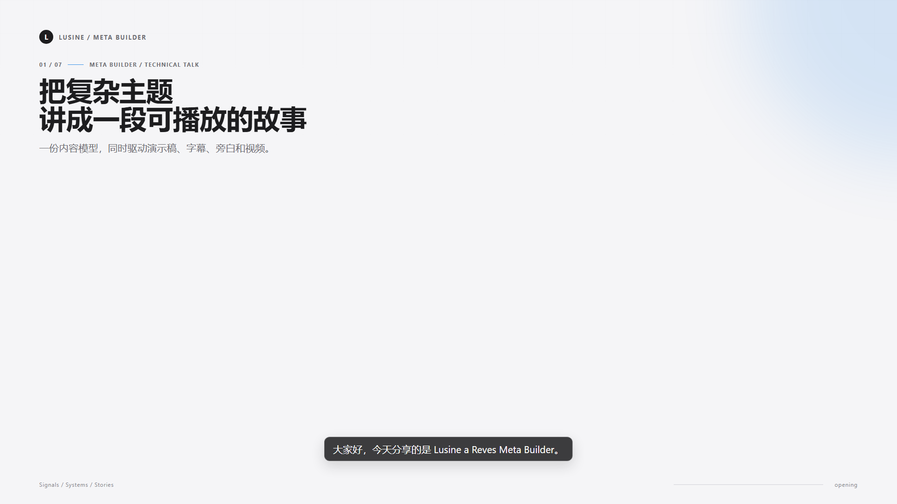

# Lusine a Reves

> l'usine à rêves
>
> la fábrica de sueños
>
> the dream factory
>
> Фабрика грёз
>
> 夢の工場

用一份 `presentation.json` 生成同一主题的：

- 可编辑 PPTX 演示稿
- Remotion MP4 视频
- 旁白、字幕和音频时间轴

`core/` 是可复用的生成资产，`example/` 是仅用于展示能力的 `signals-systems-stories` 示例。制作新主题时不要修改 `example/`。



## 1. 安装

需要 Node.js 22.18.0+、Python 3.10+、[uv](https://docs.astral.sh/uv/)、FFmpeg 和 FFprobe。

```powershell
npm install
uv sync
uv run lusine-meta doctor
```

## 2. 运行仓库示例

示例已经带有音频，不需要安装 TTS 模型：

```powershell
npm run check
npm run dev
```

Remotion Studio 打开后选择 `Presentation`。`npm run dev` 默认加载示例；预览自己的主题时加参数即可，不必先渲染 MP4：

```powershell
npm run dev -- `
  --presentation work/my-topic/presentation.json `
  --manifest work/my-topic/audio-manifest.json `
  --public-dir work/my-topic/public
```

示例输入在：

```text
example/content/presentation.json
example/content/audio-manifest.json
example/public/audio/
```

示例的 `audio-manifest.json` 已随仓库提交，因此全新克隆可直接运行 `npm test`、`npm run lint` 和 `npm run check`。修改示例音频后再运行 `npm run manifest` 更新它。

导出示例：

```powershell
npm run export:pptx
npm run render
```

默认输出：

```text
out/signals-systems-stories.pptx
out/signals-systems-stories.mp4
```

`out/` 是被 Git 忽略的本地生成目录；运行 `npm run render` 后，视频位于 `out/signals-systems-stories.mp4`。

## 3. 制作新主题

新主题必须先完成意图确认，再开始撰写 `presentation.json`。工程不能从一个含糊的主题名可靠推断人物名单、受众、叙事角度或事实边界；确认 brief 是内容生成的前置条件。

先运行交互式 intake：

```powershell
uv run lusine-meta intake --brief work/my-topic/topic-brief.json
```

命令会询问 12 项**必答**信息（主题、目标、受众、范围、实体名单、叙事角度、语气、语言、页数、时长、交付物、约束）和 4 项**可选**信息（视觉方向、旁白音色/情绪/语速，可留空跳过），最后展示完整摘要。只有输入 `yes` 才会写入 `status: "confirmed"`。必答项不完整或用户否定确认时保留为 `draft`，不能进入内容撰写阶段。已确认的 brief 默认不会被静默修改；即使传入 `--source`，命令也会在分析资料前停止，需显式使用 `--revise`。只问必答项可加 `--minimal`。

旁白音色、情绪、语速**只作意图记录**，不改变任何合成参数——实际声音由 `--profile` 选择的 TTS profile 固定决定。

可以把资料文件直接纳入确认过程。工程会读取 Markdown/UTF-8 文本，记录路径、SHA-256、标题、结构信号，并给出可人工调整的视觉建议：

```powershell
uv run lusine-meta ingest --source "C:\资料\主题全记录.md" --output work/my-topic/material-analysis.json
uv run lusine-meta intake --source "C:\资料\主题全记录.md" --brief work/my-topic/topic-brief.json
```

资料分析结果不是额外的装饰层：intake 会把它转成 brief 中可编辑的设计方向，用户确认后再把最终决定写入 `presentation.json` 的 `style` 字段（密度、动效、字体、圆角、背景纹理）。渲染器完整消费这份配置——`density` 影响间距字号、`motion` 影响入场动画、`mood` 输出为 `data-mood` 与 PPTX `category`。

`theme` 的 7 个颜色在视频与 PPTX 中语义一致：**`paper` 是背景，`ink` 是前景**，深色主题只需交换这两个值。不想手填色值时直接套预设：

```powershell
uv run lusine-meta apply-theme --preset core/profiles/theme.ink-dark.json --presentation work/my-topic/presentation.json
```

可用预设：`theme.neutral-accent.json`（通用浅色）、`theme.ink-dark.json`（深色）、`theme.ink-paper-rust.json`（文献纪录）、`theme.ink-paper-teal.json`（研究编辑）；`ingest` 会按资料信号推荐其一。

自动化场景也必须显式确认，避免把一次性参数误当成用户意图：

```powershell
uv run lusine-meta intake `
  --brief work/my-topic/topic-brief.json `
  --answers work/my-topic/answers.json `
  --yes
```

完成确认后，再复制模板并填写 `presentation.json`：

最省事的方式不是从零设计 JSON，而是只填写模板里的值。工程已经提供字段名、页面类型、默认主题和命令所需的结构。

### 3.1 复制模板

在仓库根目录执行：

```powershell
New-Item -ItemType Directory -Force work/my-topic/public/audio, work/my-topic/public/images
Copy-Item templates/presentation.template.json work/my-topic/presentation.json
```

模板文件是 [`templates/presentation.template.json`](templates/presentation.template.json)。只需要把模板中的中文占位内容替换成自己的内容；字段名、颜色、页面类型和目录结构先保持不变。

复制后得到：

```text
work/my-topic/
├── presentation.json         从模板复制，只修改 value
└── public/
    ├── audio/                放入或生成旁白
    └── images/               放入模板 image 页引用的图片
```

`work/my-topic` 不要求加入仓库，也可以换成任意目录名或绝对路径。

### 3.2 只填写这些 value

模板中的 key 已经准备好，用户主要填写以下 value：

| key | 用户填写什么 | 示例 |
| --- | --- | --- |
| `id` | 主题的英文短名 | `robotics-in-2026` |
| `title` | 演讲标题 | `2026 年机器人趋势` |
| `subtitle` | 一句话副标题 | `从实验室走向真实世界` |
| `author` | 作者或团队名 | `Acme Research` |
| `brand` | 页眉和 PPTX 元数据中的品牌名 | `Acme Research` |
| `locale` | PPTX 语言/区域标记 | `zh-CN` |
| `slides[].title` | 每页标题 | `三个变化正在发生` |
| `slides[].subtitle` | 每页解释 | `它们会改变产品设计` |
| `slides[].body` | 正文页内容 | 一段解释性文字 |
| `slides[].stats` | 概览页的三个事实 | 数值、标签、说明 |
| `slides[].callout` | 页面结论 | `关键不是规模，而是反馈速度` |
| `slides[].narration` | 这一页完整旁白 | 一段自然语言 |
| `slides[].audio` | 音频文件名 | `audio/opening.wav` |

模板默认包含 `title`、`overview`、`image`、`closing` 四页。需要更多页面时，复制一个 slide 对象，修改 `id`、`type` 和其中的 value 即可。支持的页面类型见下一节。

`eyebrow` 只写语义标签（如 `INTRO`），页码由渲染器按实际顺序生成，不要手写 `01 /`，否则增删页面后会错位。

必须注意：

- `schemaVersion` 必须是 `1`。
- `id` 只能使用小写字母、数字和连字符，例如 `my-topic`。
- 每个 slide 的 `id` 必须唯一。
- `audio` 是相对于该主题 `public/` 的路径，所以写 `audio/opening.wav`，不要写 `public/audio/opening.wav`。
- `narration` 是 TTS 文本；如果已有外部音频，也可以只提供 `audio`。
- 修改旁白或音频后，必须重新生成 `audio-manifest.json`。

### 3.3 选择页面类型

每个 slide 都需要 `id`、`type` 和 `title`：

| `type` | 适合内容 | 必需字段 |
| --- | --- | --- |
| `title` | 开场 | — |
| `text` | 正文、说明、列表 | — |
| `overview` | 概览（1–4 列） | `stats` |
| `metrics` | 指标和结论（1–4 列） | `stats` |
| `diagram` | 流程或架构（1–5 节点） | `nodes` |
| `image` | 配图、截图、图表 | `image` |
| `quote` | 重点引述 | `quote` 或 `body` |
| `closing` | 结尾页 | `quote` |

可选通用字段：`eyebrow`、`subtitle`、`body`、`bullets`、`quote`、`callout`、`narration`、`audio`、`minDurationSec`、`captions`、`themeOverride`。

页面类型承诺一份内容：`overview` 缺 `stats`、`image` 缺 `image` 会直接校验失败，而不是渲染出结构合法但视觉空白的页。`stats` 最多 4 个、`nodes` 最多 5 个，两个渲染器都按实际数量均分宽度。

**配图页**（图片放在该主题 `public/images/` 下，支持 png/jpg/jpeg/webp）：

```json
{
  "id": "visual", "type": "image", "title": "配图页标题",
  "image": { "src": "images/shot.png", "alt": "无障碍描述，必填", "caption": "图注", "fit": "contain" }
}
```

**分章节换色**（`themeOverride` 只影响该页，未指定的键继承 deck 主题）：

```json
{ "id": "chapter-2", "type": "title", "title": "第二章", "themeOverride": { "paper": "#2b1f14", "accent3": "#ff7043" } }
```

### 3.4 准备旁白音频

有两种方式，二选一。

#### 方式 A：使用已有音频

把音频放到：

```text
work/my-topic/public/audio/<slide-id>.wav
```

并在对应 slide 中填写：

```json
"audio": "audio/opening.wav"
```

支持 `.wav`、`.mp3` 和 `.m4a`。音频必须有有效时长和可听电平。

#### 方式 B：使用工程的 TTS 命令

Windows SAPI 适合快速生成：

```powershell
npm run voiceover -- `
  --presentation work/my-topic/presentation.json `
  --profile core/profiles/tts-profile.windows-sapi.json `
  --public-dir work/my-topic/public
```

Edge TTS 使用 Microsoft 在线语音服务。先创建仓库本地、固定版本的 runtime（不写入项目 Python 环境）：

```powershell
npm run install:edge-tts
npm run voiceover:edge -- `
  --presentation work/my-topic/presentation.json `
  --profile core/profiles/tts-profile.edge-tts.json `
  --public-dir work/my-topic/public
```

安装脚本固定 `edge-tts==7.2.8`。执行脚本先取得服务端 MP3，再用 FFmpeg 固定转换成 **24 kHz、单声道、PCM 16-bit WAV**，并通过音量门禁；因此 profile 和最终媒体格式保持一致。该路线每次合成都需要网络和 Microsoft 服务可用。

CosyVoice2 适合高质量旁白，但需要在仓库外准备模型、runtime 和 zero-shot prompt audio。随仓库的 profile **不含本机路径**：在 Linux/WSL 中设置 `COSYVOICE_ROOT`，或复制 profile 到调用方目录后填入该机器的 `runtimeRoot`；Windows/WSL2 还需要通过 `COSYVOICE_PYTHON_WSL` 或调用方 profile 的 `wslPython` 指定已安装 adapter 的 Python。配置完成后执行：

```powershell
npm run voiceover -- `
  --presentation work/my-topic/presentation.json `
  --profile work/my-topic/tts-profile.cosyvoice2.json `
  --public-dir work/my-topic/public
```

未配置时命令会明确失败，不会猜测驱动器或 `/mnt` 路径。模型权重和 runtime 不放进仓库。`voice`、speaker、情绪、采样参数统一由 profile 管理，不要写到 slide 里。

Qwen3-TTS 使用官方 PyTorch `qwen-tts` CustomVoice API；Ubuntu/CUDA 路线先创建隔离 runtime：

```powershell
npm run install:qwen3-tts
```

默认固定 `qwen-tts==0.1.1`、CUDA 12.6 的 `torch==2.7.1+cu126` 和同版本 `torchaudio`。如果本机 CUDA 版本不同，必须同时显式设置 `QWEN3_TTS_TORCH_VERSION` 与 `QWEN3_TTS_TORCH_INDEX_URL`，不要混用 wheel 版本。首次合成会按 profile 下载固定模型 `Qwen/Qwen3-TTS-12Hz-1.7B-CustomVoice`。

先生成带 profile/request hash 的确定性计划，再执行它：

```powershell
uv run lusine-meta tts-plan `
  --presentation work/my-topic/presentation.json `
  --profile core/profiles/tts-profile.qwen3.json `
  --brief work/my-topic/topic-brief.json `
  --output out/my-topic/tts-plan.json

npm run voiceover:qwen3 -- `
  --plan out/my-topic/tts-plan.json `
  --public-dir work/my-topic/public `
  --device cuda:0
```

执行器会验证每个 request hash、全局 profile、一致的固定 generation 参数和 public-relative WAV 输出路径；使用官方 `generate_custom_voice` 写出 24 kHz、单声道、PCM 16-bit WAV。随后继续执行下面的 manifest 和导出步骤。

### 3.5 生成 manifest、校验并导出

这是新主题的完整命令顺序：

```powershell
npm run manifest -- `
  --presentation work/my-topic/presentation.json `
  --manifest work/my-topic/audio-manifest.json `
  --public-dir work/my-topic/public

npm run check -- `
  --presentation work/my-topic/presentation.json `
  --manifest work/my-topic/audio-manifest.json `
  --public-dir work/my-topic/public `
  --brief work/my-topic/topic-brief.json

npm run export:pptx -- `
  --presentation work/my-topic/presentation.json `
  --manifest work/my-topic/audio-manifest.json `
  --public-dir work/my-topic/public `
  --output-dir out/my-topic

npm run render -- `
  --presentation work/my-topic/presentation.json `
  --manifest work/my-topic/audio-manifest.json `
  --public-dir work/my-topic/public `
  --output-dir out/my-topic
```

最终得到：

```text
out/my-topic/
├── my-topic.pptx
└── my-topic.mp4
```

`check` 会检查 JSON、页面类型、音频路径、manifest 和音频时长。`render` 会在编码前再次刷新 manifest 和校验，因此旁白时长会自动决定视频页面长度。

## 字幕

字幕写在 slide 的 `captions` 数组中，时间单位是毫秒：

```json
"captions": [
  {
    "text": "这一句字幕",
    "startMs": 0,
    "endMs": 2400,
    "timestampMs": null,
    "confidence": null
  }
]
```

没有字幕时仍可生成视频；设置 `"showCaptions": false` 可以关闭字幕显示。每条字幕必须满足 `endMs > startMs`，不能相互重叠；有音频时不能超过音频时长，无音频时不能超过该页的 `minDurationSec`。

## 常用命令

| 命令 | 用途 |
| --- | --- |
| `npm run dev` | Remotion Studio 预览（可传 `--presentation` 预览自己的主题） |
| `npm run voiceover` | 原有 Windows SAPI / 兼容 TTS 生成入口 |
| `npm run install:edge-tts` | 安装固定版本的隔离 Edge TTS runtime |
| `npm run voiceover:edge` | 在线 Edge TTS 合成并转为 24 kHz 单声道 WAV |
| `npm run install:qwen3-tts` | 安装固定版本的隔离 Qwen3-TTS CUDA runtime |
| `npm run voiceover:qwen3` | 执行带 hash 的 Qwen3-TTS 请求计划 |
| `npm run manifest` | 读取音频并生成 manifest |
| `npm run check` | 校验主题和音频 |
| `npm run export:pptx` | 导出演示稿 |
| `npm run render` | 导出 MP4 |
| `npm run lint` | ESLint 和 TypeScript 检查 |
| `npm test` | Node 测试 |
| `uv run pytest` | Python 测试 |
| `uv run lusine-meta ingest` | 分析资料并推荐调色板预设 |
| `uv run lusine-meta apply-theme` | 把调色板预设写入 `presentation.json` |

所有内容生成命令都可以使用：

```text
--presentation <path>   内容 JSON
--manifest <path>       音频 manifest
--public-dir <path>     主题的 public 目录
--profile <path>        TTS profile
--output-dir <path>     输出目录
--force                 重新生成已存在的旁白 / 强制重新探测音频
--help                  显示该命令的用法
```

参数名会被严格校验：拼错会直接报错并给出最接近的建议，而不是静默回退到内置示例。

```text
$ npm run check -- --presentaton work/my-topic/presentation.json
Unknown flag: --presentaton (did you mean --presentation?)
```

任何脚本都可以用 `--help` 查看用法：

```powershell
node core/scripts/render.mjs --help
```

`npm run manifest` 会按内容哈希跳过未变的音频（`ffmpeg volumedetect` 需要解码整个音频文件）。示例的 7 段共 110 秒旁白，全量探测约 0.32s，全部命中缓存约 0.03s；音频越长收益越明显。用 `--force` 可强制重新探测。

## 代码位置

- [`core/src/domain.ts`](core/src/domain.ts)：内容 schema
- [`core/src/Presentation.tsx`](core/src/Presentation.tsx)：通用页面渲染器
- [`core/src/timeline.ts`](core/src/timeline.ts)：音频时间轴
- [`core/scripts/validate-deck.mjs`](core/scripts/validate-deck.mjs)：主题校验
- [`core/scripts/export-pptx.mjs`](core/scripts/export-pptx.mjs)：PPTX 生成
- [`core/scripts/render.mjs`](core/scripts/render.mjs)：MP4 生成
- [`core/docs/content-schema.md`](core/docs/content-schema.md)：完整字段说明
- [`core/docs/tts.md`](core/docs/tts.md)：TTS 约束和运行边界

## 发布前检查

```powershell
npm run lint
npm test
uv run pytest
npm run check
```

本仓库不包含模型权重、TTS runtime、API key 或个人参考音频。当前未声明开源许可证，发布 GitHub 前请根据实际授权补充 `LICENSE`。
